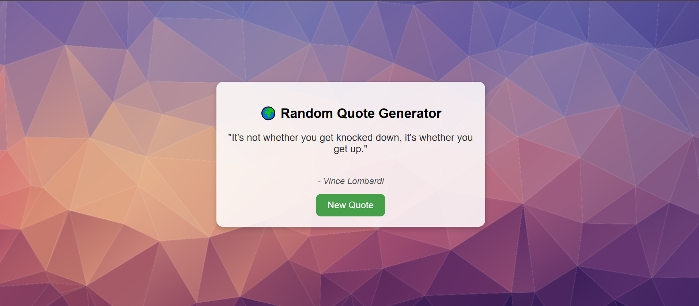

# 🌍 Random Quote Generator  

A simple and interactive **Random Quote Generator** built using **HTML, CSS, and JavaScript**.  
It displays motivational quotes fetched from an API and changes the background image dynamically every time you click the button.  

---

## 🚀 Features
- Fetches random motivational quotes using [Quotable API](https://api.quotable.io/).  
- Attractive UI with dynamic **background images**.  
- Smooth transition effects for background changes.  
- Responsive design – works on desktop and mobile.  
- Button to generate a new random quote instantly.  

---

## 🛠️ Technologies Used
- **HTML5** – Structure of the webpage  
- **CSS3** – Styling & layout (with transparency & blur effect for the card)  
- **JavaScript (ES6)** – API call, DOM manipulation, random background logic  

---

## 📂 Project Structure
RANDON QUOTE GENERATO/ 
│-- image  
│-- index.html 
│-- README.md

---

## 🖼️ Preview  

---

## ⚡ live demo 
1. Clone this repository:  
[Live Demo](https://yusuf-maxx.github.io/Randon_Quote_Genretor/)

